# 8-Bit Timers (TMR)

## Introduction

This LSI includes **two on-chip 8-bit timer units**: Unit 0 and Unit 1. Each unit consists of **two independent 8-bit counter channels**, giving a total of **four channels**.

The 8-bit timer module is highly flexible and can be used for a variety of applications, including:
- Counting external events
- Generating counter reset signals
- Generating interrupt requests
- Producing pulse outputs with a desired duty cycle using compare-match logic

Each channel uses **two compare-match registers**, allowing for accurate timing and control in embedded systems.


## Block Diagram


## Operation
### Pulse Output:
1. In TCR, clear bit CCLR1 to 0 and set bit CCLR0 to 1 so that TCNT is cleared at a TCORA compare match.
2. In TCSR, set bits OS3 to OS0 to B'0110, causing the output to change to 1 at a TCORA compare match and to 0 at a TCORB compare match.
3. In TCR, clear bit CKS2, CKS1, CKS0 to 0 and clear ICKS1 to 0, set ICKS0 to 1 to use internal clock and counts at rising edge of P/2.
```sh
//UNIT 0
0000_0000_0000_0000 	//TCNT
0000_1110_1111_1111 	//TCORA
0000_0111_1111_1111 	//TCORB
0000_1001_0000_0000 	//TCR 	
0000_0001_0000_0000 	//TCCR
0000_0110_0001_0000 	//TCSR

//UNIT 1
0000_0000_0000_0000 	//TCNT
1111_1111_1111_1111 	//TCORA
1111_1111_1111_1111 	//TCORB
0000_0000_0000_0000 	//TCR
0000_0000_0000_0000 	//TCCR
0000_0000_0001_0000 	//TCSR
```
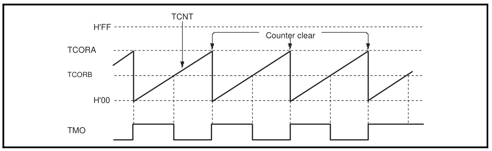
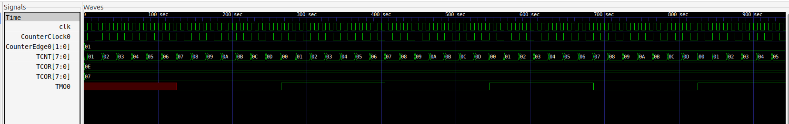


### Reset Input:
1. Set both bits CCLR1 and CCLR0 in TCR to 1 and set the TMRIS bit in TCCR to 1 so that TCNT is cleared at the high level input of the TMRI signal.
2. In TCSR, set bits OS3 to OS0 to B'0110, causing the output to change to 1 at a TCORA compare match and to 0 at a TCORB compare match.
```sh
//UNIT 0
0000_0000_0000_0000 	//TCNT
0000_1110_1111_1111 	//TCORA
0000_0111_1111_1111 	//TCORB
0001_1001_0000_0000 	//TCR 	
0000_1001_0000_0000 	//TCCR
0000_0110_0001_0000 	//TCSR

//UNIT 1
0000_0000_0000_0000 	//TCNT
1111_1111_1111_1111 	//TCORA
1111_1111_1111_1111 	//TCORB
0000_0000_0000_0000 	//TCR
0000_0000_0000_0000 	//TCCR
0000_0000_0001_0000 	//TCSR
```
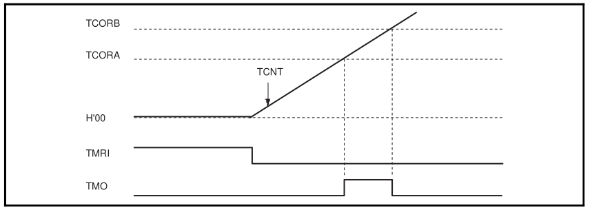
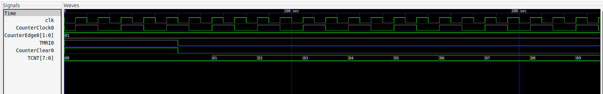


## Operation Timing
### TCNT Count Timing
The external clock pulse width must be at least 1.5 states for incrementation at a single edge, and at least 2.5 states for incrementation at both edges. The counter will not increment correctly if the pulse width is less than these values.
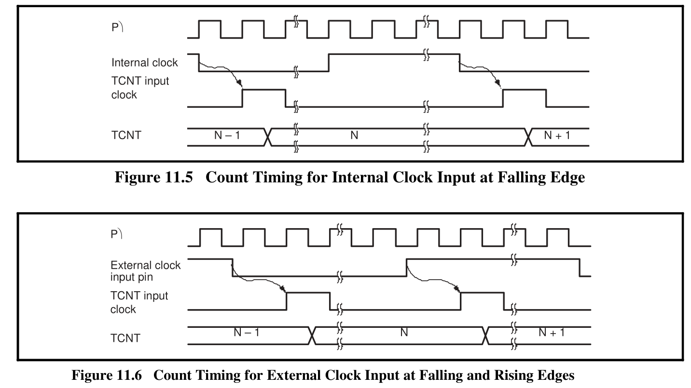
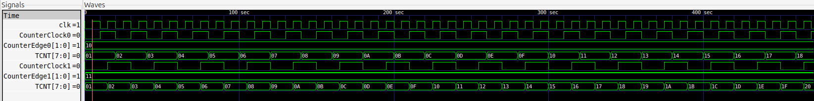

### Timing of CMFA and CMFB Setting at Compare Match
The CMFA and CMFB flags in TCSR are set to 1 by a compare match signal generated when the TCOR and TCNT values match.
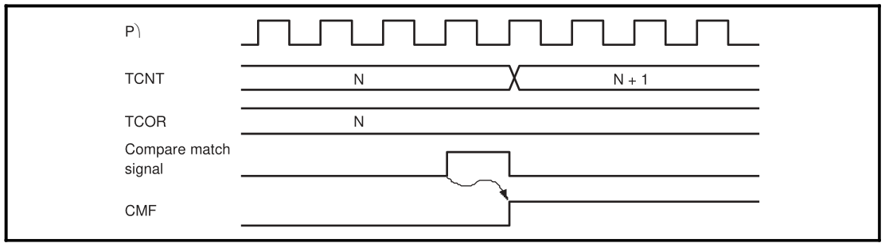
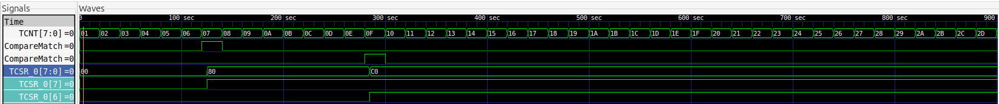

### Timing of Overflow Flag (OVF) Setting
The OVF bit in TCSR is set to 1 when TCNT overflows
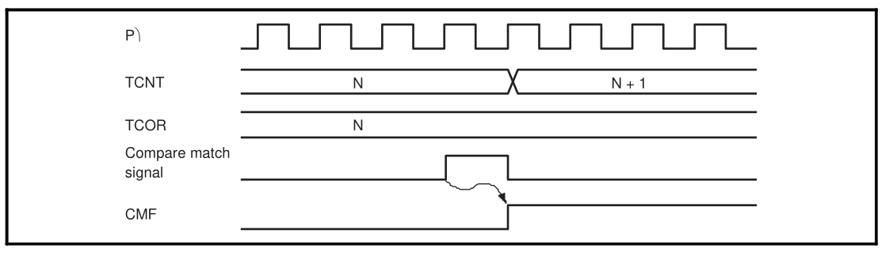
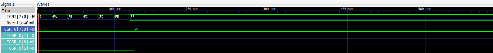

## Synthesis using Vivado
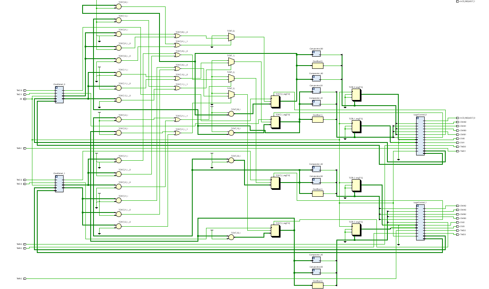
